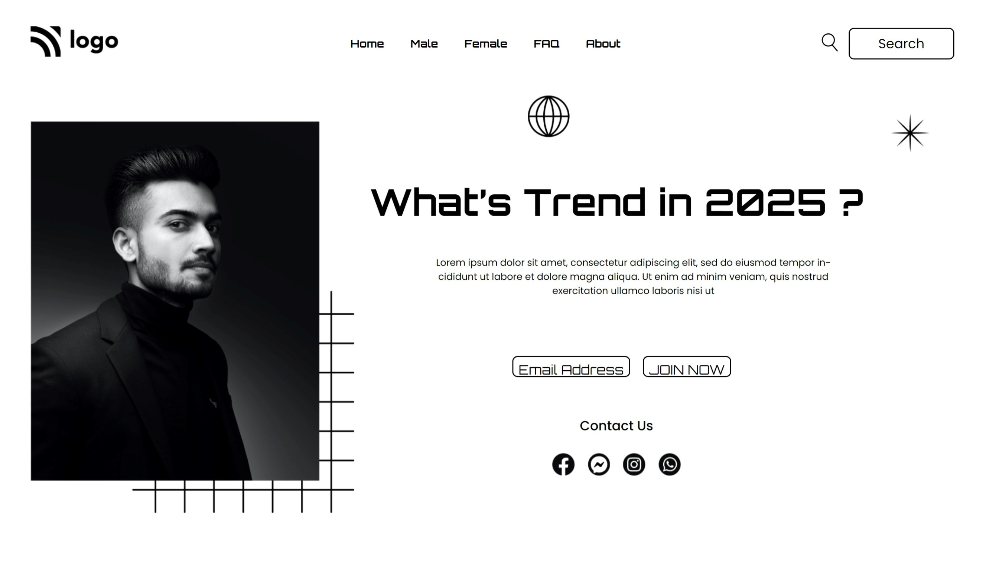

# 
**Project 01 - Street Style Landing Page**

First project of this course. It was very confising with item placement and their other related properties. But it was great fun to complete.

## **By : Kalpesh K Dhotre**
 

> ## Topics learnt in this project
- Position of object
- Basic html structure
- CSS emmet shortcut
- margins
   

> ## Time to complete this project 
> # **2 days**

### [🌏 Deployed link]("https://github.com/kalpeshdhotre/live-class-project-01")
 

## Below is screenshot of webpage 
 

